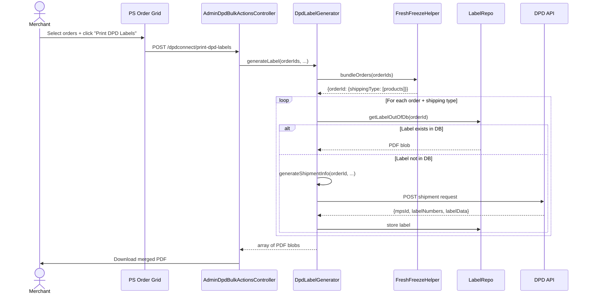
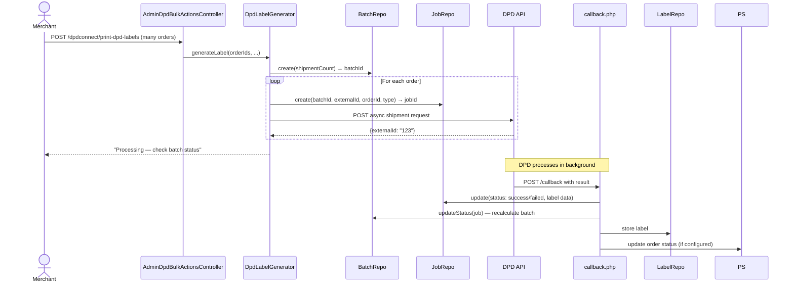
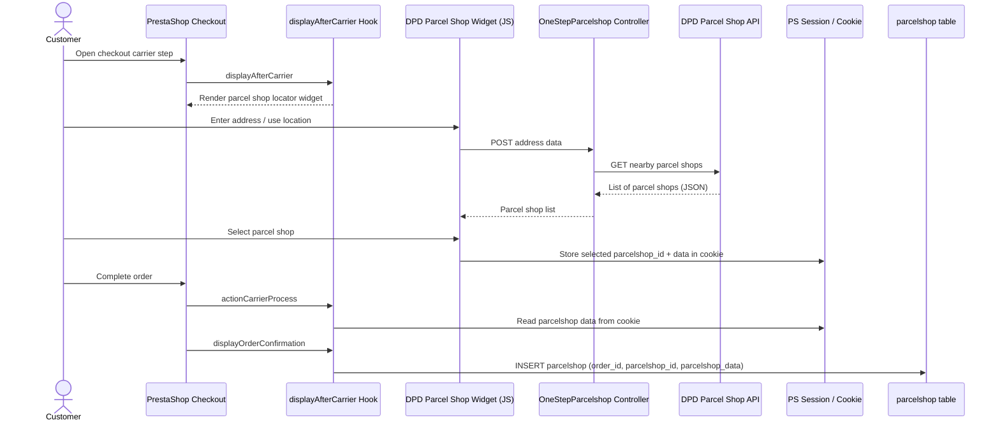
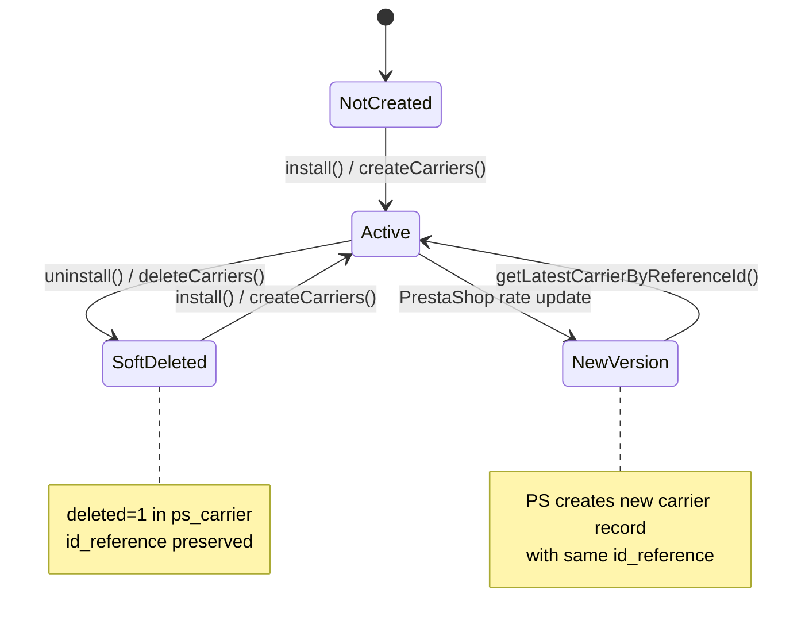
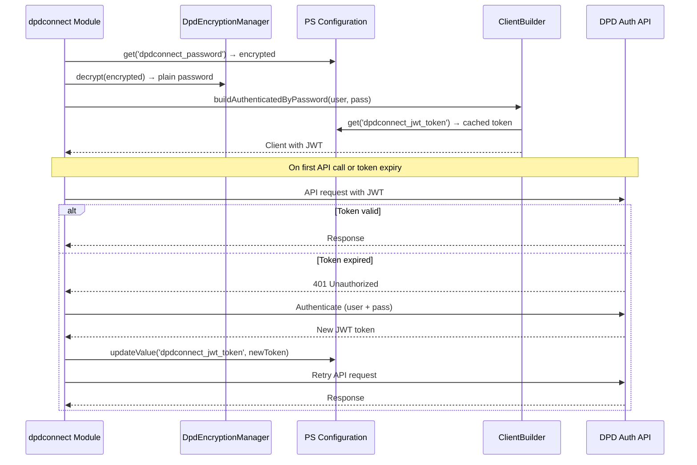

<!--
DOCS_METADATA:
  generated_at: 2026-02-19T09:59:14Z
  git_hash: ea1640e
  tool_version: 1.0.0
  source_command: /create-documentation
-->

# Architecture & Flow Diagrams

<!-- AUTO-GENERATED:START - Do not edit manually -->

## Module Architecture Overview

```mermaid
graph TB
    subgraph "PrestaShop Core"
        PS_HOOKS[Hook System]
        PS_DB[(MySQL Database)]
        PS_CONFIG[Configuration Store]
        PS_ORDERS[Order Management]
    end

    subgraph "dpdconnect Module"
        MAIN[dpdconnect.php<br/>Module Entry Point]

        subgraph "Connect Layer"
            CONN[Connection.php<br/>API Client Factory]
            CACHE[DpdConnectCache]
            JWT[JWT Token Manager]
        end

        subgraph "Business Logic"
            LABELGEN[DpdLabelGenerator<br/>Label Orchestrator]
            CARRIER[DpdCarrier<br/>Carrier Manager]
            PREDICT[DpdParcelPredict<br/>Parcel Prediction]
            FRESH[FreshFreezeHelper<br/>Temp-controlled Shipping]
            SHIPLIST[DpdShippingList<br/>PDF Shipping List]
        end

        subgraph "Data Layer"
            LABELREPO[LabelRepo<br/>dpdshipment_label]
            BATCHREPO[BatchRepo<br/>dpd_batches]
            JOBREPO[JobRepo<br/>dpd_jobs]
            PRODHELPER[DpdProductHelper<br/>carrier_dpd_product]
        end

        subgraph "Admin Controllers"
            BULK[AdminDpdBulkActionsController]
            LABELS[AdminDpdLabelsController]
            BATCHES[AdminDpdBatchesController]
            FF[AdminDpdFreshFreezeController]
        end

        subgraph "Frontend Controllers"
            PS_SHOP[OneStepParcelshop<br/>AJAX Locator]
            CALLBACK[callback.php<br/>DPD Webhook]
        end

        ENCRYPT[DpdEncryptionManager<br/>AES-128-CBC]
    end

    subgraph "DPD Connect API"
        DPD_AUTH[Authentication / JWT]
        DPD_LABELS[Labels API]
        DPD_PRODUCTS[Products API]
        DPD_PARCELSHOP[Parcel Shop API]
    end

    PS_HOOKS --> MAIN
    MAIN --> CONN
    CONN --> ENCRYPT
    CONN --> JWT
    CONN --> CACHE
    CONN --> DPD_AUTH

    MAIN --> LABELGEN
    LABELGEN --> CONN
    LABELGEN --> LABELREPO
    LABELGEN --> BATCHREPO
    LABELGEN --> JOBREPO
    LABELGEN --> DPD_LABELS

    MAIN --> CARRIER
    CARRIER --> DPD_PRODUCTS
    CARRIER --> PRODHELPER

    MAIN --> PREDICT
    PREDICT --> CONN

    BULK --> LABELGEN
    BULK --> SHIPLIST
    LABELS --> LABELREPO
    BATCHES --> BATCHREPO
    FF --> FRESH

    PS_SHOP --> DPD_PARCELSHOP
    CALLBACK --> JOBREPO
    CALLBACK --> BATCHREPO
    CALLBACK --> LABELREPO

    LABELREPO --> PS_DB
    BATCHREPO --> PS_DB
    JOBREPO --> PS_DB
    PRODHELPER --> PS_DB
    CONN --> PS_CONFIG
```



---

## Label Generation Flow (Synchronous)

For small batches (below `dpdconnect_async_treshold`):



---

## Label Generation Flow (Asynchronous)

For large batches (above `dpdconnect_async_treshold`):



---

## Checkout Parcel Shop Flow



---

## Carrier Lifecycle



---

## Authentication & JWT Flow



---

## Batch Status State Machine

```mermaid
stateDiagram-v2
    [*] --> status_queued : BatchRepo::create()

    status_queued --> status_processing : First job starts
    status_processing --> status_success : All jobs succeeded
    status_processing --> status_failed : All jobs failed
    status_processing --> status_partially_failed : Mix of success + failure

    note right of status_partially_failed
        successCount > 0 AND failureCount > 0
    end note
```

<!-- AUTO-GENERATED:END -->

<!-- MANUAL:START - Safe to edit, preserved on updates -->
<!-- MANUAL:END -->
