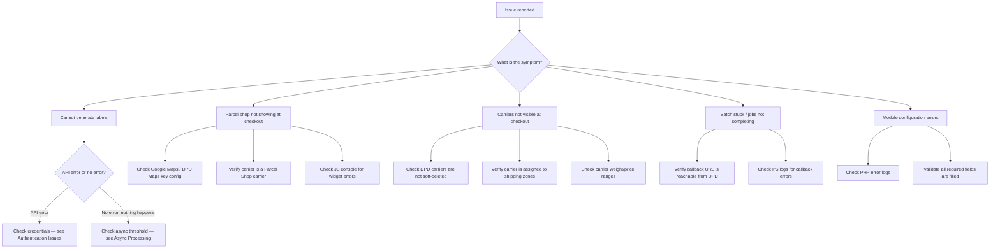

<!--
DOCS_METADATA:
  generated_at: 2026-02-19T09:59:14Z
  git_hash: ea1640e
  tool_version: 1.0.0
  source_command: /create-documentation
-->

# Troubleshooting Guide

<!-- AUTO-GENERATED:START - Do not edit manually -->

## Quick Triage



---

## Authentication Issues

### Symptom: "No credentials provided" error

**Cause**: `dpdconnect_password` configuration is empty.

**Fix**: Go to **Module Configure** and re-enter credentials.

---

### Symptom: LOGIN_8 error on label generation

**Cause**: Invalid username/password combination.

**Fix**:
1. Go to **Module Configure**
2. Verify username and password with DPD
3. Save — password is re-encrypted on save

> **Note**: If `_COOKIE_KEY_` changed (e.g., after a PrestaShop migration), stored passwords are invalidated. Re-enter credentials after any such change.

---

### Symptom: JWT token errors

**Cause**: Cached JWT token is expired or corrupted.

**Fix**: Clear the JWT token from PS configuration:

```sql
DELETE FROM ps_configuration WHERE name = 'dpdconnect_jwt_token';
```

The module will re-authenticate on the next API call.

---

## Label Generation Issues

### Symptom: Label generation fails silently / no download

**Check**:
1. Is the order using a DPD carrier? (`DpdParcelPredict::checkIfDpdSending()` must return true)
2. Is `dpdconnect_async_treshold` set very low? Orders above the threshold go async — check the Batches page.
3. Check PS logs for exception details.

---

### Symptom: Label already exists (duplicate label warning)

**Cause**: A label for this order+return combination already exists in `dpdshipment_label`.

**Fix**: The module retrieves the existing label. If you need to regenerate, delete the existing label record from the database:

```sql
DELETE FROM ps_dpdshipment_label WHERE order_id = :orderId AND retour = 0;
```

---

### Symptom: PDF is blank or corrupted

**Cause**: `pdfmerger` library issue or incomplete label data from DPD.

**Check**:
- Verify the raw label blob in `ps_dpdshipment_label.label` is valid PDF binary
- Try downloading a single label instead of a merged PDF

---

## Async Batch Processing

### Symptom: Batch stuck in `status_queued` or `status_processing`

**Cause**: The DPD callback URL is not reachable.

**Fix**:
1. Verify `dpdconnect_callback_url` is set and publicly accessible
2. Test the callback URL from a browser: it should return a valid response (not a 404 or redirect)
3. Check firewall rules — DPD must be able to POST to this URL
4. Check PS logs for callback controller errors

---

### Symptom: Jobs show `status_failed`

**Cause**: DPD API rejected the shipment request.

**Fix**: Check the `error` column in `ps_dpd_jobs` for the DPD error message:

```sql
SELECT order_id, error, state_message
FROM ps_dpd_jobs
WHERE status = 'status_failed'
ORDER BY created_at DESC
LIMIT 20;
```

Common errors:
- Address validation failures — verify the shipping address
- Missing HS code for international shipments — add via Product Attributes
- Weight out of range — check `dpdconnect_default_product_weight`

---

## Carrier Issues

### Symptom: DPD carriers not visible at checkout

**Possible causes**:

1. **Carriers are soft-deleted** — Check:
   ```sql
   SELECT id_carrier, name, deleted FROM ps_carrier WHERE name LIKE '%DPD%';
   ```
   If `deleted = 1`, reinstall the module or run `DpdCarrier::createCarriers()`.

2. **Carrier not assigned to a zone** — In PS back office, go to **Shipping → Carriers** and verify the DPD carrier has zones assigned.

3. **Carrier weight/price limits** — Verify the order weight is within the carrier's configured range.

4. **Carrier not assigned to the shop** (multistore) — Check shop association in carrier settings.

---

### Symptom: Saturday carrier not appearing

**Cause**: The configured Saturday delivery window is outside current time.

**Check** (`DpdCarrier::checkIfSaturdayAllowed()`):
- Verify `dpdconnect_saturday_showfromday`, `dpdconnect_saturday_showfromtime`, `dpdconnect_saturday_showtillday`, `dpdconnect_saturday_showtilltime` are all configured.
- Saturday delivery only appears within the configured day/time window.

---

## Parcel Shop Issues

### Symptom: Parcel shop locator widget not loading

**Check**:
1. Is the selected carrier a DPD parcel shop carrier?
2. Is `dpdconnect_maps_key` set (or `dpdconnect_use_dpd_key = 1`)?
3. Check browser console for JS errors
4. Verify `dpdconnect_url` is set — the parcel shop map JS is served from the DPD API URL

---

### Symptom: Parcel shop not saved to order

**Cause**: Cookie was lost between carrier selection and order confirmation.

**Check**: The `displayOrderConfirmation` hook reads parcel shop data from a cookie and writes to `ps_parcelshop`. If the cookie is missing (e.g., session expired or cleared), the parcel shop won't be saved.

---

## Module Configuration Issues

### Symptom: "Settings not saved" / validation errors

**Cause**: `SettingsDataValidator` rejected one or more values.

**Fix**: Check the error messages displayed on the configuration page. Ensure all required fields contain valid values.

---

### Symptom: Module configuration page is blank / errors

**Fix**:
1. Check PHP error logs for fatal errors
2. Verify `vendor/` directory exists and is complete (`composer install`)
3. Check if any required PHP extensions are missing (openssl for encryption)

---

## Database Troubleshooting

### Check existing labels for an order

```sql
SELECT id_dpdcarrier_label, mps_id, label_nummer, created_at, shipped, retour
FROM ps_dpdshipment_label
WHERE order_id = :orderId;
```

### Check parcel shop for an order

```sql
SELECT parcelshop_id, parcelshop_data
FROM ps_parcelshop
WHERE order_id = :orderId;
```

### Check recent batch/job status

```sql
SELECT b.id_dpd_batches, b.status, b.shipment_count, b.success_count, b.failure_count,
       b.created_at
FROM ps_dpd_batches b
ORDER BY b.created_at DESC
LIMIT 10;

SELECT j.id_dpd_jobs, j.order_id, j.status, j.type, j.error, j.created_at
FROM ps_dpd_jobs j
WHERE j.batch_id = :batchId
ORDER BY j.created_at;
```

---

## Escalation Template

```
**Summary**: [One sentence]
**Environment**: [Production / Staging / Dev]
**PrestaShop version**: [e.g. 8.1.x]
**DPD Connect module version**: [e.g. 2.1]
**Severity**: [Low / Medium / High / Critical]

**Symptoms**:
- [What the merchant sees]

**Investigation done**:
- [ ] Checked PS error logs
- [ ] Verified API credentials
- [ ] Checked carrier configuration
- [ ] Checked dpd_batches / dpd_jobs tables
- [ ] Verified callback URL is accessible

**Relevant logs/errors**:
[Paste here]

**Order IDs affected**:
[List here]
```

<!-- AUTO-GENERATED:END -->

<!-- MANUAL:START - Safe to edit, preserved on updates -->
<!-- MANUAL:END -->
